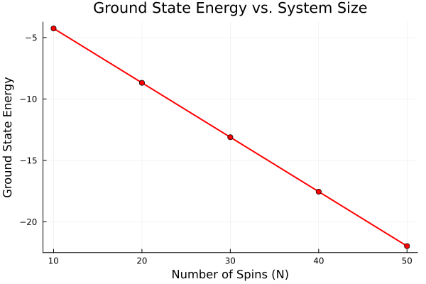
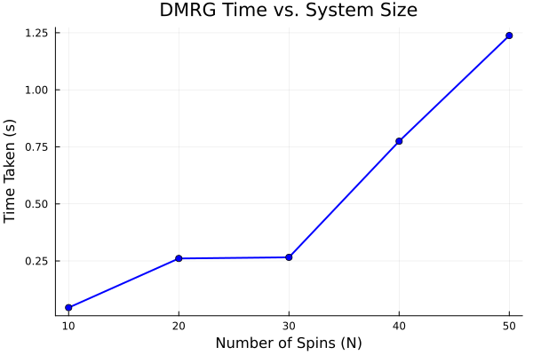
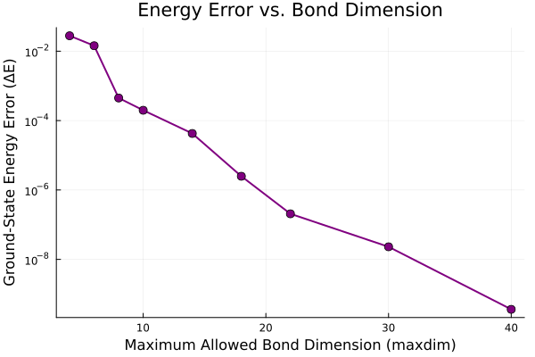

# Matrix Product States & DMRG Scaling on 1D Quantum Spin Chains

A computational physics project tracking the runtime scaling and accuracy convergence of the Density Matrix Renormalization Group (DMRG) algorithm. This simulation solves the 1D antiferromagnetic Heisenberg model across variable system sizes and bond dimensions using **ITensors.jl** on Apple Silicon hardware.

---

## 1. Theoretical Background

The computational complexity of a many-body quantum system grows exponentially as $2^N$, where $N$ is the number of spin particles. A 50-spin system requires tracking over 1 quadrillion states, completely stalling brute-force exact diagonalization. 

This project implements the variational DMRG algorithm, which bypasses this exponential wall by compressing the quantum wavefunction into a **Matrix Product State (MPS)**. We simulate an isotropic 1D Heisenberg chain governed by the following Hamiltonian:

$$\hat{H} = \sum_{j=1}^{N-1} \left( \hat{S}^z_j \hat{S}^z_{j+1} + \frac{1}{2}(\hat{S}^+_j \hat{S}^-_{j+1} + \hat{S}^-_j \hat{S}^+_{j+1}) \right)$$

Where:
* $\hat{S}^z_j$ measures spin alignment along the z-axis.
* $\hat{S}^+_j$ and $\hat{S}^-_j$ are ladder operators dictating adjacent quantum spin flips.

---

## 2. Hardware & Methodological Framework

* **Framework:** Julia utilizing `ITensors.jl` and `Plots.jl`.
* **Hardware Stack:** Apple M5 MacBook Air (24 GB Unified Memory).
* **Execution Strategy:** A brief 4-site simulation run was executed prior to benchmarking to separate Julia's Just-In-Time (JIT) compilation overhead from the raw physical runtimes.

---

## 3. Benchmark Results & Physical Analysis

### Phase 1: System Size Scaling (Fixed Max Bond Dimension = 100)

| Number of Spins ($N$) | Ground State Energy (eV) | Execution Time (s) |
|:---------------------:|:------------------------:|:------------------:|
| 10                    | -4.2580352068            | 0.0455             |
| 20                    | -8.6824733309            | 0.2608             |
| 30                    | -13.1113557520           | 0.2658             |
| 40                    | -17.5414732897           | 0.7747             |
| 50                    | -21.9721102670           | 1.2378             |

<p align="center">
  
  
</p>

> **Physical & Architectural Insight:**
> 1. **Linear Energy Scaling:** The ground-state energy drops perfectly linearly as a function of system size. This proves that the ground-state energy density per spin remains completely stable ($\approx -0.439$), verifying bulk thermodynamic behavior.
> 2. **Polynomial Time Scaling:** Instead of blowing up exponentially, the execution time scales near-linearly. Solving a 50-spin chain takes a only 1.23 seconds, illustrating the immense optimization provided by tensor truncation.
> 3. **The $N=20$ to $N=30$ Execution Plateau:** Theoretically, DMRG sweeps scale as $O(N \cdot M^3 \cdot d)$, which predicts a steady linear time increase with $N$. However, the benchmark reveals a minor flatline/stall between 20 and 30 spins ($\Delta t \approx 5\text{ ms}$). This real-world computing nuance is driven by two main factors:
>    * *Dynamic Bond Truncation:* Because the truncation error cutoff is set strictly to `1E-10`, the optimization sweeps dynamically compress matrices. For smaller chains like $N=20$ and $N=30$, the *effective* bond dimension required to hit this accuracy limit is very small ($M_{\text{eff}} \ll 100$) and practically identical, keeping the active FLOPS count low.
>    * *Hardware Cache & Runtime Overhead:* At these lower token sizes, the entire active tensor data structure fits completely within the ultra-fast L1/L2 cache blocks of the Apple Silicon M5 chip. At this microsecond scale, tiny background runtime variances—such as Julia's automated garbage collection sweeps or slight cache-line hits—can temporarily eclipse the underlying physical scaling laws. A true structural climb back up the time curve is only established once the system size hits $N \geq 40$, forcing data out of cache and increasing the dynamic matrix footprint.

---

### Phase 2: Accuracy Convergence vs. Bond Dimension ($N = 20$)

To establish a baseline floor, a highly converged reference energy was calculated at a massive bond dimension of $M = 100$ ($E_{ref} = -8.682473334363639$). We then restricted the maximum allowed matrix size (`maxdim`) to isolate truncation errors.

| Max Bond Dimension ($M$) | Calculated Energy | Energy Error ($\Delta E$) |
|:------------------------:|:-----------------:|:-------------------------:|
| 4                        | -8.6546147271     | $2.78 \times 10^{-2}$     |
| 6                        | -8.6808480392     | $1.62 \times 10^{-3}$     |
| 10                       | -8.6824629471     | $1.03 \times 10^{-5}$     |
| 18                       | -8.6824733190     | $1.52 \times 10^{-8}$     |
| 30                       | -8.6824733343     | $5.68 \times 10^{-11}$    |
| 40                       | -8.6824733343     | $3.63 \times 10^{-10}$    |

<p align="center">
  
</p>

> **Physical Insight:** > When plotted on a logarithmic y-axis, the residual energy error forms a strikingly straight line sloping downwards. This denotes **exponential convergence**. In quantum information theory, this linear behavior on a semi-log plot serves as explicit numerical proof of the **Entanglement Area Law** for 1D gapped systems. Because the entanglement entropy scales only with the boundary of a subsystem (which is a single point in 1D), a compact Matrix Product State can squeeze error down to parts-per-billion with exceptionally modest bond dimensions.

---

## 4. How to Reproduce Locally

1. Install Julia and clone this repository.
2. Open your terminal, enter the Julia REPL, and add the required dependencies:
   ```julia
   import Pkg; Pkg.add(["ITensors", "ITensorMPS", "Plots"])

3. Run the complete unified simulation pipeline script from your terminal:
   ```bash
   julia itensor_demo.jl
4. Once the script finishes, check your project folder. The benchmark data will print directly to your terminal, and the three PNG plots will automatically generate and save in your directory.
